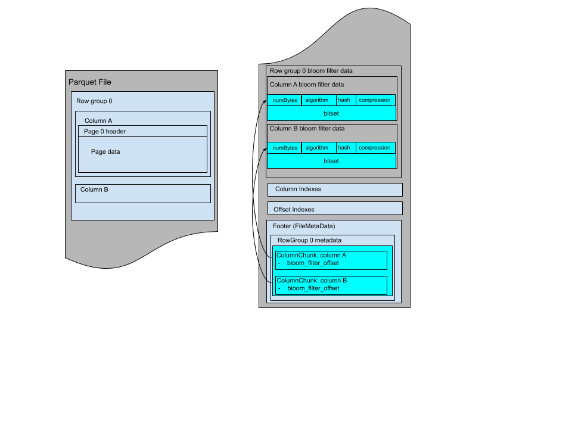

 <!--
  - Licensed to the Apache Software Foundation (ASF) under one
  - or more contributor license agreements.  See the NOTICE file
  - distributed with this work for additional information
  - regarding copyright ownership.  The ASF licenses this file
  - to you under the Apache License, Version 2.0 (the
  - "License"); you may not use this file except in compliance
  - with the License.  You may obtain a copy of the License at
  -
  -   http://www.apache.org/licenses/LICENSE-2.0
  -
  - Unless required by applicable law or agreed to in writing,
  - software distributed under the License is distributed on an
  - "AS IS" BASIS, WITHOUT WARRANTIES OR CONDITIONS OF ANY
  - KIND, either express or implied.  See the License for the
  - specific language governing permissions and limitations
  - under the License.
  -->

Parquet Bloom Filter
===
### Problem statement
In their current format, column statistics and dictionaries can be used for predicate
pushdown. Statistics include minimum and maximum value, which can be used to filter out
values not in the range. Dictionaries are more specific, and readers can filter out values
that are between min and max but not in the dictionary. However, when there are too many
distinct values, writers sometimes choose not to add dictionaries because of the extra
space they occupy. This leaves columns with large cardinalities and widely separated min
and max without support for predicate pushdown.

A [Bloom filter](https://en.wikipedia.org/wiki/Bloom_filter) is a compact data structure that
overapproximates a set. It can respond to membership queries with either "definitely no" or
"probably yes", where the probability of false positives is configured when the filter is
initialized. Bloom filters do not have false negatives.

A Bloom filter typically contains a bit array of `m` bits, `k` different hash functions,
and `n` elements inserted. Each of hash functions maps or hashes some set element to one of the
`m` array positions, generating a uniform random distribution. To add an element, feed it to each
of the `k` hash functions to get `k` array positions. Set the bits at all these positions to 1. 

Because Bloom filters are small compared to dictionaries, they can be used for predicate
pushdown even in columns with high cardinality and when space is at a premium.

### Goal
* Enable predicate pushdown for high-cardinality columns while using less space than
  dictionaries.

* Induce no additional I/O overhead when executing queries on columns without Bloom
  filters attached or when executing non-selective queries.

### Technical Approach
The initial Bloom filter algorithm in Parquet is implemented using a combination of two
Bloom filter techniques.

First, the block Bloom filter algorithm from Putze et al.'s [Cache-, Hash- and Space-Efficient
Bloom filters](http://algo2.iti.kit.edu/documents/cacheefficientbloomfilters-jea.pdf) is used.
The block Bloom filter consists of a sequence of small Bloom filters, each of which can fit
into one cache-line. For best performance, those small Bloom filters are loaded into memory
cache-line-aligned. For each potential element, the first hash value selects the Bloom filter block
to be used. Additional hash values are then used to set or test bits as usual, but only inside
this one block. As for Parquet's initial implementation, each block is 256 bits. When inserting or
finding value, the first hash of that value is used to index into the array of blocks and pick a
single one. This single block is then used for the remaining part of the operation.

Second, the remaining part of the operation within the single block uses the folklore split Bloom
filter technique, as described in section 2.1 of [Network Applications of Bloom Filters:
A Survey](https://www.eecs.harvard.edu/~michaelm/postscripts/im2005b.pdf). Instead of having one
array of size `m` shared among all the hash functions, each hash function has a range of `m/k`
consecutive bit locations disjoint from all the others. The total number of bits is still
`m`, but the bits are divided equally among the `k` hash functions. This approach
can be useful for implementation reasons, for example, dividing the bits among the hash functions
may make parallelization of array accesses easier and take utilization of SSE. As for Parquet's
implementation, it divides the 256 bits in each block up into eight contiguous 32-bit lanes and
sets or checks one bit in each lane.

#### Algorithm
In the initial algorithm, the most significant 32 bits from the hash value are used as the
index to select a block from bitset. The lower 32 bits of the hash value, along with eight
constant salt values, are used to compute the bit to set in each lane of the block.
The salt values are used to construct following different hash functions as described in
[Multiplicative hashing](https://en.wikipedia.org/wiki/Hash_function#Multiplicative_hashing):

hash<sub>i</sub>(x) = salt<sub>i</sub> * x >> y

Since the target hash value is `[0, 31]`, so we right shift `y = 27` bits. As a result, eight
hash values, which are indexes of the tiny bloom filter, are generated.

```c
// 8 SALT values used to compute bit pattern
static const uint32_t SALT[8] = {0x47b6137bU, 0x44974d91U, 0x8824ad5bU, 0xa2b7289dU,
  0x705495c7U, 0x2df1424bU, 0x9efc4947U, 0x5c6bfb31U};

// key: the lower 32 bits of hash result
// mask: the output bit pattern for a tiny Bloom filter
void Mask(uint32_t key, uint32_t mask[8]) {
  for (int i = 0; i < 8; ++i) {
    mask[i] = key * SALT[i];
  }
  for (int i = 0; i < 8; ++i) {
    mask[i] = mask[i] >> 27;
  }
  for (int i = 0; i < 8; ++i) {
    mask[i] = UINT32_C(1) << mask[i];
  }
}

```

#### Hash Function
The function used to hash values in the initial implementation is
[xxHash](https://cyan4973.github.io/xxHash/), using the function XXH64 with a
seed of 0 and [following the specification version
0.1.1](https://github.com/Cyan4973/xxHash/blob/v0.7.0/doc/xxhash_spec.md).

#### Build a Bloom filter
The fact that exactly eight bits are checked during each lookup means that these filters
are most space efficient when used with an expected false positive rate of about
0.5%. This is achieved when there are about 11.54 bits for every distinct value inserted
into the filter.

To calculate the size the filter should be for another false positive rate `p`, use the
following formula. The output is in bits per distinct element:

```c
c = -8 / log(1 - pow(p, 1.0 / 8))
```

In the real scenario, the size of the Bloom filter and the false positive rate may vary from
different implementations. It is recommended to set false positive to 1% so that a Bloom filter
with 1.2MB size can contain one million distinct values, which should satisfy most cases according
to default row group size. It is also recommended to expose the ability for setting these
parameters to end users.

#### File Format

Each multi-block Bloom filter is required to work for only one column chunk. The data of a multi-block Bloom
filter contains the header of one Bloom filter, which must include the size of the filter in bytes, the algorithm,
the hash function, the compression and the Bloom filter bitset. The offset in column chunk metadata points to the start of
the Bloom filter header. 
Here are the Bloom filter definitions in thrift:

```
/** Block-based algorithm type annotation. **/
struct SplitBlockAlgorithm {}
/** The algorithm used in Bloom filter. **/
union BloomFilterAlgorithm {
  /** Block-based Bloom filter. **/
  1: SplitBlockAlgorithm BLOCK;
}

/** Hash strategy type annotation. xxHash is an extremely fast non-cryptographic hash
 * algorithm. It uses 64 bits version of xxHash. 
 **/
struct XxHash {}

/** 
 * The hash function used in Bloom filter. This function takes the hash of a column value
 * using plain encoding.
 **/
union BloomFilterHash {
  /** xxHash Strategy. **/
  1: XxHash XXHASH;
}

/**
  * Bloom filter header is stored at beginning of Bloom filter data of each column
  * and followed by its bitset.
  **/
struct BloomFilterPageHeader {
  /** The size of bitset in bytes **/
  1: required i32 numBytes;
  /** The algorithm for setting bits. **/
  2: required BloomFilterAlgorithm algorithm;
  /** The hash function used for Bloom filter. **/
  3: required BloomFilterHash hash;
}

struct ColumnMetaData {
  ...
  /** Byte offset from beginning of file to Bloom filter data. **/
  14: optional i64 bloom_filter_offset;
}

```

The Bloom filters are grouped by row group and with data for each column in the same order as the file schema.
The Bloom filter data can be stored before the page indexes after all row groups. The file layout looks like:
 

Or it can be stored between row groups, the file layout looks like:
 

#### Encryption
In the case of columns with sensitive data, the Bloom filter exposes a subset of sensitive
information such as the presence of value. Therefore the Bloom filter of columns with sensitive
data should be encrypted with the column key, and the Bloom filter of other (not sensitive) columns
do not need to be encrypted.

Bloom filters have two serializable modules - the PageHeader thrift structure (with its internal
fields, including the BloomFilterPageHeader `bloom_filter_page_header`), and the Bitset. The header
structure is serialized by Thrift, and written to file output stream; it is followed by the
serialized Bitset.

For Bloom filters in sensitive columns, each of the two modules will be encrypted after
serialization, and then written to the file. The encryption will be performed using the AES GCM
cipher, with the same column key, but with different AAD module types - "BloomFilter Header" (8)
and "BloomFilter Bitset" (9). The length of the encrypted buffer is written before the buffer, as
described in the Parquet encryption specification.
