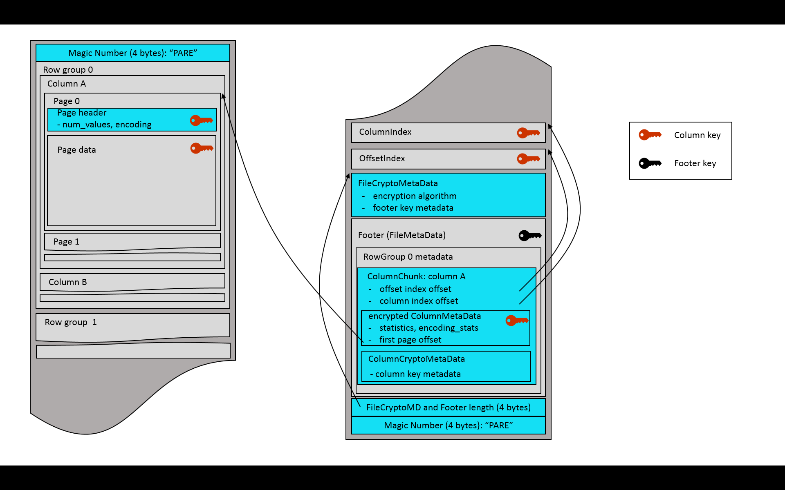

<!--
  - Licensed to the Apache Software Foundation (ASF) under one
  - or more contributor license agreements.  See the NOTICE file
  - distributed with this work for additional information
  - regarding copyright ownership.  The ASF licenses this file
  - to you under the Apache License, Version 2.0 (the
  - "License"); you may not use this file except in compliance
  - with the License.  You may obtain a copy of the License at
  -
  -   http://www.apache.org/licenses/LICENSE-2.0
  -
  - Unless required by applicable law or agreed to in writing,
  - software distributed under the License is distributed on an
  - "AS IS" BASIS, WITHOUT WARRANTIES OR CONDITIONS OF ANY
  - KIND, either express or implied.  See the License for the
  - specific language governing permissions and limitations
  - under the License.
  -->

# Parquet Modular Encryption

Parquet files containing sensitive information can be protected by the modular encryption 
mechanism that encrypts and authenticates the file data and metadata - while allowing 
for a regular Parquet functionality (columnar projection, predicate pushdown, encoding 
and compression). 

## 1 Problem Statement
Existing data protection solutions (such as flat encryption of files, in-storage encryption, 
or use of an encrypting storage client) can be applied to Parquet files, but have various 
security or performance issues. An encryption mechanism, integrated in the Parquet format, 
allows for an optimal combination of data security, processing speed and encryption granularity.

## 2 Goals
1. Protect Parquet data and metadata by encryption, while enabling selective reads 
(columnar projection, predicate push-down).
2. Implement "client-side" encryption/decryption (storage client). The storage server 
must not see plaintext data, metadata or encryption keys.
3. Leverage authenticated encryption that allows clients to check integrity of the retrieved 
data - making sure the file (or file parts) have not been replaced with a wrong version, or 
tampered with otherwise.
4. Enable different encryption keys for different columns and for the footer.
5. Allow for partial encryption - encrypt only column(s) with sensitive data.
6. Work with all compression and encoding mechanisms supported in Parquet.
7. Support multiple encryption algorithms, to account for different security and performance 
requirements.
8. Enable two modes for metadata protection -
   * full protection of file metadata
   * partial protection of file metadata that allows legacy readers to access unencrypted 
columns in an encrypted file.
9.	Minimize overhead of encryption - in terms of size of encrypted files, and throughput 
of write/read operations.


## 3 Technical Approach
Parquet files are comprised of separately serialized components: pages, page headers, column 
indexes, offset indexes, a footer. Parquet encryption mechanism denotes them as “modules” 
and encrypts each module separately – making it possible to fetch and decrypt the footer, 
find the offset of required pages, fetch the pages and decrypt the data. In this document, 
the term “footer” always refers to the regular Parquet footer - the `FileMetaData` structure, 
and its nested fields (row groups / column chunks). 

File encryption is flexible - each column and the footer can be encrypted with the same key, 
with a different key, or not encrypted at all.

The results of compression of column pages are encrypted before being written to the output 
stream. A new Thrift structure, with column crypto metadata, is added to column chunks of 
the encrypted columns. This metadata provides information about the column encryption keys.

The results of serialization of Thrift structures are encrypted, before being written 
to the output stream. 

The file footer can be either encrypted or left as a plaintext. In an encrypted footer mode, 
a new Thrift structure with file crypto metadata is added to the file. This metadata provides 
information about the file encryption algorithm and the footer encryption key. 

In a plaintext footer mode, the contents of the footer structure is visible and signed 
in order to verify its integrity. New footer fields keep an
information about the file encryption algorithm and the footer signing key.

For encrypted columns, the following modules are always encrypted, with the same column key: 
pages and  page headers (both dictionary and data), column indexes, offset indexes.  If the 
column key is different from the footer encryption key, the column metadata is serialized 
separately and encrypted with the column key. In this case, the column metadata is also 
considered to be a module.  

There are two module types: data modules (pages) and Thrift modules (all Thrift structures that 
are serialized separately).


## 4 Encryption Algorithms and Keys
Parquet encryption algorithms are based on the standard AES ciphers for symmetric encryption. 
AES is supported in Intel and other CPUs with hardware acceleration of crypto operations 
(“AES-NI”) - that can be leveraged, for example, by Java programs (automatically via HotSpot), 
or C++ programs (via EVP-* functions in OpenSSL). Parquet supports all standard AES key sizes: 
128, 192 and 256 bits. 

Initially, two algorithms have been implemented, one based on a GCM mode of AES, and the 
other on a combination of GCM and CTR modes.

### 4.1 AES modes used in Parquet

#### 4.1.1 AES GCM
AES GCM is an authenticated encryption. Besides the data confidentiality (encryption), it 
supports two levels of integrity verification (authentication): of the data (default), 
and of the data combined with an optional AAD (“additional authenticated data”). The 
authentication allows to make sure the data has not been tampered with. An AAD 
is a free text to be authenticated, together with the data. The user can, for example, pass the 
file name with its version (or creation timestamp) as an AAD input, to verify that the 
file has not been replaced with an older version. The details on how Parquet creates 
and uses AADs are provided in the section 4.4.

#### 4.1.2 AES CTR
AES CTR is a regular (not authenticated) cipher. It is faster than the GCM cipher, since it 
doesn’t perform integrity verification and doesn’t calculate an authentication tag. 
Actually, GCM is a combination of the CTR cipher and an 
authentication layer called GMAC. For applications running without AES acceleration 
(e.g. on Java versions before Java 9) and willing to compromise on content verification, 
CTR cipher can provide a boost in encryption/decryption throughput.


#### 4.1.3 Nonces and IVs
GCM and CTR ciphers require a unique vector to be provided for each encrypted stream. 
In this document, the unique input to GCM encryption is called nonce (“number used once”).
The unique input to CTR encryption is called IV ("initialization vector"), and is comprised of two 
parts: a nonce and an initial counter field. 

Parquet encryption uses the RBG-based (random bit generator) nonce construction as defined in 
the section 8.2.2 of the NIST SP 800-38D document. For each encrypted module, Parquet generates a 
unique nonce with a length of 12 bytes (96 bits). Notice: the NIST 
specification uses a term “IV” for what is called “nonce” in the Parquet encryption design.


### 4.2 Parquet encryption algorithms

#### 4.2.1 AES_GCM_V1
This Parquet algorithm encrypts all modules by the GCM cipher, without padding. The AES GCM cipher
must be implemented by a cryptographic provider according to the NIST SP 800-38D specification. 

In Parquet, an input to the GCM cipher is an encryption key, a 12-byte nonce, a plaintext and an 
AAD. The output is a ciphertext with the length equal to that of plaintext, and a 16-byte authentication 
tag used to verify the ciphertext and AAD integrity.


#### 4.2.2 AES_GCM_CTR_V1
In this Parquet algorithm, all Thrift modules are encrypted with the GCM cipher, as described 
above, but the pages are encrypted by the CTR cipher without padding. This allows to encrypt/decrypt 
the bulk of the data faster, while still verifying the metadata integrity and making 
sure the file has not been replaced with a wrong version. However, tampering with the 
page data might go unnoticed. The AES CTR cipher
must be implemented by a cryptographic provider according to the NIST SP 800-38A specification. 

In Parquet, an input to the CTR cipher is an encryption key, a 16-byte IV and a plaintext. IVs are comprised of 
a 12-byte nonce and a 4-byte initial counter field. The first 31 bits of the initial counter field are set 
to 0, the last bit is set to 1. The output is a ciphertext with the length equal to that of plaintext.

### 4.3 Key metadata
A wide variety of services and tools for management of encryption keys exist in the 
industry today. Public clouds offer different key management services (KMS), and 
organizational IT systems either build proprietary key managers in-house or adopt open source 
tools for on-premises deployment. Besides the diversity of management tools, there are many 
ways to generate and handle the keys themselves (generate Data keys inside KMS – or locally 
upon data encryption; use Data keys only, or use Master keys to encrypt the Data keys; 
store the encrypted key material inside the data file, or at a separate location; etc). There 
is also a large variety of authorization and certification methods, required to control the 
access to encryption keys.

Parquet is not limited to a single KMS, key generation/wrapping method, or authorization service. 
Instead, Parquet provides a developer with a simple interface that can be utilized for implementation 
of any key management scheme. For each column or footer key, a file writer can generate and pass an 
arbitrary `key_metadata` byte array that will be stored in the file. This field is made available to 
file readers to enable recovery of the key. For example, the key_metadata 
can keep a serialized

   * String ID of a Data key. This enables direct retrieval of the Data key from a KMS.
   * Encrypted Data key, and string ID of a Master key. The Data key is generated randomly and 
   encrypted with a Master key either remotely in a KMS, or locally after retrieving the Master key from a KMS.
   Master key rotation requires modification of the data file footer.
   * Short ID (counter) of a Data key inside the Parquet data file. The Data key is encrypted with a 
   Master key using one of the options described above – but the resulting key material is stored 
   separately, outside the data file, and will be retrieved using the counter and file path.
   Master key rotation doesn't require modification of the data file.
   
Key metadata can also be empty - in a case the encryption keys are fully managed by the caller 
code, and passed explicitly to Parquet readers for the file footer and each encrypted column.

### 4.4 Additional Authenticated Data
The AES GCM cipher protects against byte replacement inside a ciphertext - but, without an AAD, 
it can't prevent replacement of one ciphertext with another (encrypted with the same key). 
Parquet modular encryption leverages AADs to protect against swapping ciphertext modules (encrypted 
with AES GCM) inside a file or between files. Parquet can also protect against swapping full 
files - for example, replacement of a file with an old version, or replacement of one table 
partition with another. AADs are built to reflects the identity of a file and of the modules 
inside the file. 

Parquet constructs a module AAD from two components: an optional AAD prefix - a string provided 
by the user for the file, and an AAD suffix, built internally for each GCM-encrypted module 
inside the file. The AAD prefix should reflect the target identity that helps to detect file 
swapping (a simple example - table name with a date and partition, e.g. "employees_23May2018.part0"). 
The AAD suffix reflects the internal identity of modules inside the file, which for example 
prevents replacement of column pages in row group 0 by pages from the same column in row 
group 1. The module AAD is a direct concatenation of the prefix and suffix parts. 

#### 4.4.1 AAD prefix
File swapping can be prevented by an AAD prefix string, that uniquely identifies the file and 
allows to differentiate it e.g. from older versions of the file or from other partition files in the same 
data set (table). This string is optionally passed by a writer upon file creation. If provided,
the AAD prefix is stored in an `aad_prefix` field in the file, and is made available to the readers. 
This field is not encrypted. If a user is concerned about keeping the file identity inside the file, 
the writer code can explicitly request Parquet not to store the AAD prefix. Then the aad_prefix field 
will be empty; AAD prefixes must be fully managed by the caller code and supplied explictly to Parquet 
readers for each file.

The protection against swapping full files is optional. It is not enabled by default because 
it requires the writers to generate and pass an AAD prefix.

A reader of a file created with an AAD prefix, should be able to verify the prefix (file identity)
by comparing it with e.g. the target table name, using a convention accepted in the organization.
Readers of data sets, comprised of multiple partition files, can verify data set integrity by 
checking the number of files and the AAD prefix of each file. For example, a reader that needs to 
process the employee table, a May 23 version, knows (via the convention) that 
the AAD prefix must be "employees_23May2018.partN" in 
each corresponding table file. If a file AAD prefix is "employees_23May2018.part0", the reader 
will know it is fine, but if the prefix is "employees_23May2016.part0" or "contractors_23May2018.part0" - 
the file is wrong. The reader should also know the number of table partitions and verify availability 
of all partition files (prefixes) from 0 to N-1.

   
#### 4.4.2 AAD suffix
The suffix part of a module AAD protects against module swapping inside a file. It also protects against 
module swapping between files  - in situations when an encryption key is re-used in multiple files and the 
writer has not provided a unique AAD prefix for each file. 

Unlike AAD prefix, a suffix is built internally by Parquet, by direct concatenation of the following parts: 
1.	[All modules] internal file identifier - a random byte array generated for each file (implementation-defined length)
2.	[All modules] module type (1 byte)
3.	[All modules except footer] row group ordinal (2 byte short, little endian)
4.	[All modules except footer] column ordinal (2 byte short, little endian)
5.	[Data page and header only] page ordinal (2 byte short, little endian)

The following module types are defined:  

   * Footer (0)
   * ColumnMetaData (1)
   * Data Page (2)
   * Dictionary Page (3)
   * Data PageHeader (4)
   * Dictionary PageHeader (5)
   * ColumnIndex (6)
   * OffsetIndex (7)


|                      | Internal File ID | Module type | Row group ordinal | Column ordinal | Page ordinal|
|----------------------|------------------|-------------|-------------------|----------------|-------------|
| Footer               |       yes        |   yes (0)   |        no         |      no        |     no      |
| ColumnMetaData       |       yes        |   yes (1)   |        yes        |      yes       |     no      |
| Data Page            |       yes        |   yes (2)   |        yes        |      yes       |     yes     |
| Dictionary Page      |       yes        |   yes (3)   |        yes        |      yes       |     no      |
| Data PageHeader      |       yes        |   yes (4)   |        yes        |      yes       |     yes     |
| Dictionary PageHeader|       yes        |   yes (5)   |        yes        |      yes       |     no      |
| ColumnIndex          |       yes        |   yes (6)   |        yes        |      yes       |     no      |
| OffsetIndex          |       yes        |   yes (7)   |        yes        |      yes       |     no      |


## 5 File Format

### 5.1 Encrypted module serialization
The Thrift modules are encrypted with the GCM cipher. In the AES_GCM_V1 algorithm, 
the column pages (data modules) are also encrypted with AES GCM. For each module, the GCM encryption 
buffer is comprised of a nonce, ciphertext and tag, described in the Algorithms section. The length of 
the encryption buffer (a 4-byte little endian) is written to the output stream, followed by the buffer itself.

|length (4 bytes) | nonce (12 bytes) | ciphertext (length-28 bytes) | tag (16 bytes) |
|-----------------|------------------|------------------------------|----------------|


In the AES_GCM_CTR_V1 algorithm, the column pages are encrypted with AES CTR.
For each page, the CTR encryption buffer is comprised of a nonce and ciphertext, 
described in the Algorithms section. The length of the encryption buffer 
(a 4-byte little endian) is written to the output stream, followed by the buffer itself.

|length (4 bytes) | nonce (12 bytes) | ciphertext (length-12 bytes) |
|-----------------|------------------|------------------------------|


### 5.2 Crypto structures
Parquet file encryption algorithm is specified in a union of the following Thrift structures:

```c
struct AesGcmV1 {
  /** AAD prefix **/
  1: optional binary aad_prefix

  /** Unique file identifier part of AAD suffix **/
  2: optional binary aad_file_unique
  
  /** In files encrypted with AAD prefix without storing it,
   * readers must supply the prefix **/
  3: optional bool supply_aad_prefix
}

struct AesGcmCtrV1 {
  /** AAD prefix **/
  1: optional binary aad_prefix

  /** Unique file identifier part of AAD suffix **/
  2: optional binary aad_file_unique
  
  /** In files encrypted with AAD prefix without storing it,
   * readers must supply the prefix **/
  3: optional bool supply_aad_prefix
}

union EncryptionAlgorithm {
  1: AesGcmV1 AES_GCM_V1
  2: AesGcmCtrV1 AES_GCM_CTR_V1
}
```

If a writer provides an AAD prefix, it will be used for enciphering the file and stored in the 
`aad_prefix` field. However, the writer can request Parquet not to store the prefix in the file. In 
this case, the `aad_prefix` field will not be set, and the `supply_aad_prefix` field will be set 
to _true_ to inform readers they must supply the AAD prefix for this file in order to be able to 
decrypt it.

The row group ordinal, required for AAD suffix calculation, is set in the RowGroup structure:

```c
struct RowGroup {
...
  /** Row group ordinal in the file **/
  7: optional i16 ordinal
}
```

A `crypto_metadata` field is set in each ColumnChunk in the encrypted columns. ColumnCryptoMetaData 
is a union - the actual structure is chosen depending on whether the column is encrypted with the 
footer encryption key, or with a column-specific key. For the latter, a key metadata can be specified.

```c
struct EncryptionWithFooterKey {
}

struct EncryptionWithColumnKey {
  /** Column path in schema **/
  1: required list<string> path_in_schema
  
  /** Retrieval metadata of column encryption key **/
  2: optional binary key_metadata
}

union ColumnCryptoMetaData {
  1: EncryptionWithFooterKey ENCRYPTION_WITH_FOOTER_KEY
  2: EncryptionWithColumnKey ENCRYPTION_WITH_COLUMN_KEY
}

struct ColumnChunk {
...
  /** Crypto metadata of encrypted columns **/
  8: optional ColumnCryptoMetaData crypto_metadata
}
```


### 5.3 Protection of sensitive metadata
The Parquet file footer, and its nested structures, contain sensitive information - ranging 
from a secret data (column statistics) to other information that can be exploited by an 
attacker (e.g. schema, num_values, key_value_metadata, encoding 
and crypto_metadata). This information is automatically protected when the footer and 
secret columns are encrypted with the same key. In other cases - when column(s) and the 
footer are encrypted with different keys; or column(s) are encrypted and the footer is not, 
an extra measure is required to protect the column-specific information in the file footer. 
In these cases, the `ColumnMetaData` structures are Thrift-serialized separately and encrypted 
with a column-specific key, thus protecting the column stats and 
other metadata. The column metadata module is encrypted with the GCM cipher, serialized 
according to the section 5.1 instructions and stored in an `optional binary encrypted_column_metadata` 
field in the `ColumnChunk`.

```c
struct ColumnChunk {
...
  
  /** Column metadata for this chunk.. **/
  3: optional ColumnMetaData meta_data
..
  /** Crypto metadata of encrypted columns **/
  8: optional ColumnCryptoMetaData crypto_metadata
  
  /** Encrypted column metadata for this chunk **/
  9: optional binary encrypted_column_metadata
}
```


### 5.4 Encrypted footer mode
In files with sensitive column data, a good security practice is to encrypt not only the 
secret columns, but also the file footer metadata. This hides the file schema, 
number of rows, key-value properties, column sort order, names of the encrypted columns 
and metadata of the column encryption keys. 

The columns encrypted with the same key as the footer must leave the column metadata at the original 
location, `optional ColumnMetaData meta_data` in the `ColumnChunk` structure. 
This field is not set for columns encrypted with a column-specific key - instead, the `ColumnMetaData`
is Thrift-serialized, encrypted with the column key and written to the `encrypted_column_metadata` 
field in the `ColumnChunk` structure, as described in the section 5.3.

A Thrift-serialized `FileCryptoMetaData` structure is written before the encrypted footer. 
It contains information on the file encryption algorithm and on the footer key metadata. Then 
the combined length of this structure and of the encrypted footer is written as a 4-byte 
little endian integer, followed by a final magic string, "PARE". The same magic bytes are 
written at the beginning of the file (offset 0). Parquet readers start file parsing by 
reading and checking the magic string. Therefore, the encrypted footer mode uses a new 
magic string ("PARE") in order to instruct readers to look for a file crypto metadata 
before the footer - and also to immediately inform legacy readers (expecting ‘PAR1’ 
bytes) that they can’t parse this file.

```c
/** Crypto metadata for files with encrypted footer **/
struct FileCryptoMetaData {
  /** 
   * Encryption algorithm. This field is only used for files
   * with encrypted footer. Files with plaintext footer store algorithm id
   * inside footer (FileMetaData structure).
   */
  1: required EncryptionAlgorithm encryption_algorithm
    
  /** Retrieval metadata of key used for encryption of footer, 
   *  and (possibly) columns **/
  2: optional binary key_metadata
}
```

 
 
 
### 5.5 Plaintext footer mode
This mode allows legacy Parquet versions (released before the encryption support) to access 
unencrypted columns in encrypted files - at a price of leaving certain metadata fields 
unprotected in these files. 

The plaintext footer mode can be useful during a transitional period in organizations where 
some frameworks can't be upgraded to a new Parquet library for a while. Data writers will 
upgrade and run with a new Parquet version, producing encrypted files in this mode. Data 
readers working with sensitive data will also upgrade to a new Parquet library. But other 
readers that don't need the sensitive columns, can continue working with an older Parquet 
version. They will be able to access plaintext columns in encrypted files. A legacy reader, 
trying to access a sensitive column data in an encrypted file with a plaintext footer, will 
get an exception. More specifically, a Thrift parsing exception on an encrypted page header 
structure. Again, using legacy Parquet readers for encrypted files is a temporary solution.

In the plaintext footer mode, the `optional ColumnMetaData meta_data` is set in the `ColumnChunk`
structure for all columns, but is stripped of the statistics for the sensitive (encrypted) 
columns. These statistics are available for new readers with the column key - they decrypt 
the `encrypted_column_metadata` field, described in the section 5.3, and parse it to get statistics 
and all other column metadata values. The legacy readers are not aware of the encrypted metadata field; 
they parse the regular (plaintext) field as usual. While they can't read the data of encrypted 
columns, they read their metadata to extract the offset and size of encrypted column data, 
required for column chunk vectorization.

The plaintext footer is signed in order to prevent tampering with the 
`FileMetaData` contents. The footer signing is done by encrypting the serialized `FileMetaData` 
structure with the 
AES GCM algorithm - using a footer signing key, and an AAD constructed according to the instructions 
of the section 4.4. Only the nonce and GCM tag are stored in the file – as a 28-byte 
fixed-length array, written right after  the footer itself. The ciphertext is not stored, 
because it is not required for footer integrity verification by readers.

| nonce (12 bytes) |  tag (16 bytes) |
|------------------|-----------------|


The plaintext footer mode sets the following fields in the the FileMetaData structure:

```c
struct FileMetaData {
...
  /** 
   * Encryption algorithm. This field is set only in encrypted files
   * with plaintext footer. Files with encrypted footer store algorithm id
   * in FileCryptoMetaData structure.
   */
  8: optional EncryptionAlgorithm encryption_algorithm

  /** 
   * Retrieval metadata of key used for signing the footer. 
   * Used only in encrypted files with plaintext footer. 
   */ 
  9: optional binary footer_signing_key_metadata
}
```
 
The `FileMetaData` structure is Thrift-serialized and written to the output stream.
The 28-byte footer signature is written after the plaintext footer, followed by a 4-byte little endian integer 
that contains the combined length of the footer and its signature. A final magic string, 
"PAR1", is written at the end of the 
file. The same magic string is written at the beginning of the file (offset 0). The magic bytes 
for plaintext footer mode are ‘PAR1’ to allow legacy readers to read projections of the file 
that do not include encrypted columns.

 

## 6. Encryption Overhead
The size overhead of Parquet modular encryption is negligible, since most of the encryption 
operations are performed on pages (the minimal unit of Parquet data storage and compression). 
The overhead order of magnitude is adding 1 byte per each ~30,000 bytes of original 
data - calculated by comparing the page encryption overhead (nonce + tag + length = 32 bytes) 
to the default page size (1 MB). This is a rough estimation, and can change with the encryption
algorithm (no 16-byte tag in AES_GCM_CTR_V1) and with page configuration or data encoding/compression.

The throughput overhead of Parquet modular encryption depends on whether AES enciphering is 
done in software or hardware. In both cases, performing encryption on full pages (~1MB buffers) 
instead of on much smaller individual data values causes AES to work at its maximal speed. 

