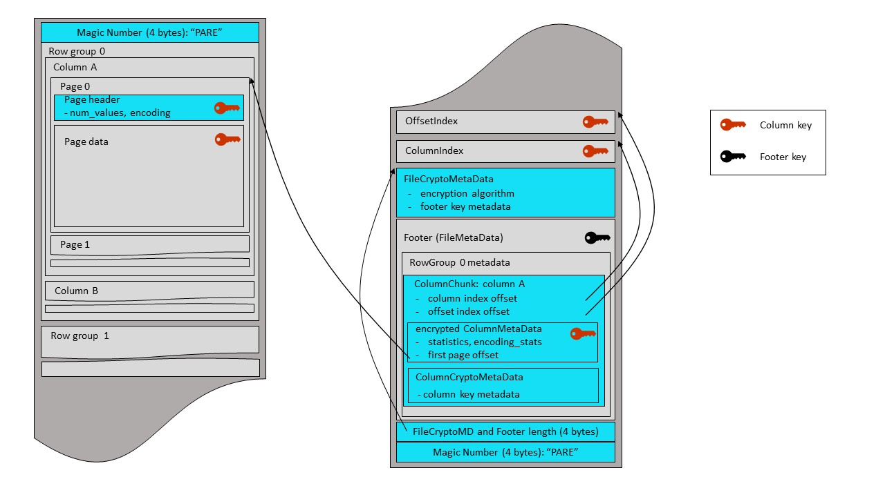
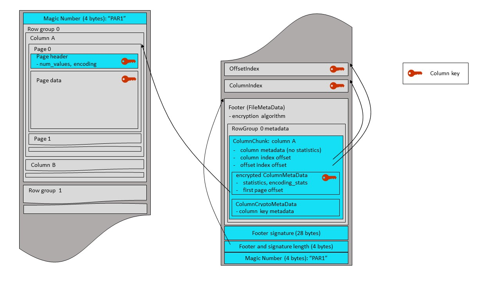

<!--
  - Licensed to the Apache Software Foundation (ASF) under one
  - or more contributor license agreements.  See the NOTICE file
  - distributed with this work for additional information
  - regarding copyright ownership.  The ASF licenses this file
  - to you under the Apache License, Version 2.0 (the
  - "License"); you may not use this file except in compliance
  - with the License.  You may obtain a copy of the License at
  -
  -   http://www.apache.org/licenses/LICENSE-2.0
  -
  - Unless required by applicable law or agreed to in writing,
  - software distributed under the License is distributed on an
  - "AS IS" BASIS, WITHOUT WARRANTIES OR CONDITIONS OF ANY
  - KIND, either express or implied.  See the License for the
  - specific language governing permissions and limitations
  - under the License.
  -->

# Parquet Modular Encryption

Parquet files containing sensitive information can be protected by the modular
encryption mechanism that encrypts and authenticates the file data and metadata - 
while allowing for a regular Parquet functionality (columnar projection, 
predicate pushdown, encoding and compression). This mechanism also enables column access 
control, via support for encryption of different columns with different keys.

## Problem Statement
Existing data protection solutions (such as flat encryption of files, in-storage 
encryption, or use of an encrypting storage client) can be applied to Parquet files,
but have various security or performance issues. An encryption mechanism, integrated in
the Parquet format, allows for an optimal combination of data security, processing
speed and access control granularity.


## Goals
1. Protect Parquet data and metadata by encryption, while enabling selective reads 
(columnar projection, predicate push-down).
2. Implement "client-side" encryption/decryption (storage client). The storage server 
must not see plaintext data, metadata or encryption keys.
3. Leverage authenticated encryption that allows clients to check integrity of the 
retrieved data - making sure the file (or file parts) have not been replaced with a 
wrong version, or tampered with otherwise.
4. Support column access control - by enabling different encryption keys for different 
columns and for the footer.
5. Allow for partial encryption - encrypt only column(s) with sensitive data.
6. Work with all compression and encoding mechanisms supported in Parquet.
7. Support multiple encryption algorithms, to account for different security and 
performance requirements.
8. Enable two modes for metadata protection:
   * full protection of file metadata
   * partial protection of file metadata that allows legacy readers to access unencrypted 
 columns in an encrypted file.
9. Minimize overhead of encryption: in terms of size of encrypted files, and throughput
of write/read operations.


## Technical Approach

Each Parquet module (footer, page headers, pages, column indexes, column metadata) is 
encrypted separately. Then it is possible to fetch and decrypt the footer, find the 
offset of required pages, fetch them and decrypt the data. In this document, the term 
“footer” always refers to the regular Parquet footer - the `FileMetaData` structure, and 
its nested fields (row groups / column chunks).

The results of compression of column pages are encrypted before being written to the 
output stream. A new Thrift structure, with column crypto metadata, is added to 
column chunks of the encrypted columns. This metadata provides information about the 
column encryption keys.

The results of Thrift serialization of metadata structures are encrypted, before being 
written to the output stream.

## Encryption algorithms

Parquet encryption algorithms are based on the standard AES ciphers for symmetric 
encryption. AES is supported in Intel and other CPUs with hardware acceleration of 
crypto operations (“AES-NI”) - that can be leveraged, for example, by Java programs 
(automatically via HotSpot), or C++ programs (via EVP-* functions in OpenSSL).

Initially, two algorithms have been implemented, one based on a GCM mode of AES, and the other 
on a combination of GCM and CTR modes.

AES-GCM is an authenticated encryption. Besides the data confidentiality (encryption), it 
supports two levels of integrity verification (authentication): of the data (default), and 
of the data combined with an optional AAD (“additional authenticated data”). The default 
authentication allows to make sure the data has not been tampered with. An AAD is a free 
text to be signed, together with the data. The user can, for example, pass the file name 
with its version (or creation timestamp) as the AAD, to verify that the file has not been 
replaced with an older version (see next subsection).

Sometimes, a hardware acceleration of AES is unavailable (e.g. in Java 8). Then AES crypto 
operations are implemented in software, and can be somewhat slow, becoming a performance 
bottleneck in certain workloads. AES-CTR is a regular (not authenticated) cipher.
It is faster than AES-GCM, since it doesn’t perform integrity verification and doesn’t 
calculate the authentication tag. Actually, AES-GCM is a combination of AES-CTR and an 
authentication module called GMAC. For applications running without AES acceleration and 
willing to compromise on content verification, AES-CTR can provide a boost in Parquet 
write/read throughput. The second Parquet algorithm encrypts the data content (pages) 
with AES-CTR, and the metadata (Thrift structures) with AES-GCM. This allows to encrypt/decrypt 
the bulk of the data faster, while still verifying the metadata integrity and making sure 
the file has not been replaced with a wrong version. However, tampering with the page data 
might go unnoticed. 

The initialization vectors (IVs) in AES GCM and CTR ciphers must be unique for each encryption key, 
since a single re-use of an IV breaks the encryption. An IV in these two modes is often called a 
nonce (“number used once”). Parquet encryption uses the RBG-based (random bit generator) IV 
construction as defined in the NIST SP 800-38D document for the GCM ciphers (section 8.2.2). 


### AES_GCM_V1
All modules are encrypted by an AES-GCM cipher, without padding. Unique IVs are generated and 
written before each ciphertext. The IV length is 12 
bytes (96 bits), which is generally considered to be the optimal size of GCM IVs.  The NIST 
specification requires a “random field” to fill all 12 bytes and an arbitrary “free field” to be empty for 
this IV length (see section 8.2.2). 

The authentication tags (16 bytes) are written after each ciphertext.

### AES_GCM_CTR_V1
Thrift modules are encrypted with AES-GCM, as described above. The pages are encrypted by an AES-CTR
cipher without padding. The nonces are generated and written before each ciphertext, with the nonce length of 16 bytes 
(128 bits). At least 12 bytes out of 16 are constructed with an RBG.

```c
struct AesGcmV1 {
  /** Retrieval metadata of AAD prefix used for encryption of pages and structures **/
  1: optional binary aad_metadata
}

struct AesGcmCtrV1 {
  /** Retrieval metadata of AAD prefix used for encryption of structures **/
  1: optional binary aad_metadata
}

union EncryptionAlgorithm {
  1: AesGcmV1 AES_GCM_V1
  2: AesGcmCtrV1 AES_GCM_CTR_V1
}
```

### AAD (Additional Authenticated Data)

The AES GCM cipher in the basic mode protects against byte replacement inside a ciphertext, 
but can't prevent replacement of one ciphertext with another (encrypted with the same key). 
This can be solved by the AAD mode, using different AADs for different ciphertexts. Parquet 
modular encryption uses the AAD mode to protect against swapping ciphertext modules inside a 
file, between files - or against swapping full files (for example, replacement of a file with an 
old version). Obviously, the AAD must reflect the identity of a file and of the modules inside 
the file. 

Parquet constructs a module AAD from two components: an optional AAD prefix - a string provided 
by the user for the file, and an AAD suffix, built internally for each encrypted module inside 
the file. The AAD prefix should reflect the target identity that helps to detect file swapping - 
for example, table name and version or date / timestamp (e.g., "employees_23_05_2018"). The 
AAD suffix reflects the internal identity of modules inside the file, which for example prevents 
replacement of column pages in row group 0 by pages from the same column in row group 1. The module 
AAD is a direct concatenation of the prefix and suffix parts. 

#### AAD prefix

A file writer passes an AAD prefix string upon file creation, that helps to differentate it from other
files and datasets. The reader should know this string apriori, or should be able to retrieve and verify
it, using a convention accepted in the organization.
For example, if a convention is to use the table name and date as the AAD prefix, the
writer of a May 23 version of employee table will use "employee_23_05_2018" as an AAD 
prefix (and as the file name). The reader that needs to process the May 23 table, knows the AAD must be 
"employee_23_05_2018", without relying on the name of the encrypted file.

The `AesGcmV1` and `AesGcmCtrV1` structures contain an optional `aad_metadata` field that can 
be used by a reader to retrieve the AAD prefix string used for file enciphering. The maximal allowed
length of `aad_metadata` is 512 bytes. If organization works with a number of different 
AAD construction methods, the `aad_metadata` can contain the method details. For example, the `aad_metadata` 
can be "MM_DD_YY" - then the reader will know the AAD prefix is "employee_05_23_18".

Alternatively, the `aad_metadata` can contain the AAD prefix itself. In this case, the reader must be able
to verify its validity. For example, if the AAD prefix stored in `aad_metadata` is "employee_23May2018", 
the reader should know it is fine, but if the `aad_metadata` stores "employee_23May2016" - the version is wrong.

### AAD suffix

Sometimes, a number of encrypted columns have their file offset either directly visible or 
possible to infer from other metadata. This might be exploited for 
attacks on file integrity (such as replacement of column pages in row group 0 by pages from the same 
column in row group 1.). While these attacks succeed under rare conditions and in any case don't harm data 
confidentiality - they can be prevented by using the column and row group identity as a part of the GCM AAD 
formation. Therefore, the `PageHeader` structures and the pages (in case of AES_GCM_V1) are enciphered using 
an AAD suffix built by direct concatenation of two parts: the row group offset in the file (8 bytes, little endian) 
and the column name (for nested columns, a concatenated path with "." separator).
All other column-specific structures (`ColumnIndex`, `OffsetIndex`; and sometimes  
`ColumnMetaData`, see below) are enciphered using the same AAD suffix.


## File Format

Parquet file encryption is flexible - each column and the footer can be encrypted with the same key, 
with a different key, or not encrypted at all.

The metadata structures (`PageHeader`, `ColumnIndex`, `OffsetIndex`; and sometimes `FileMetaData` and 
`ColumnMetaData`, see below) are encrypted after Thrift serialization. For each structure, 
the encryption buffer is comprised of an IV, ciphertext and tag, as described in the 
Algorithms section. The length of the encryption buffer (a 4-byte little endian) is 
written to the output stream, followed by the buffer itself.

|length (4 bytes) | IV (12 bytes) | ciphertext (`length` bytes) | tag (16 bytes) |
|-----------------|---------------|-----------------------------|----------------|

The column pages (data and dictionary) are encrypted after compression. For each page, 
the encryption buffer is comprised of an IV (nonce), ciphertext and (in case of AES_GCM_V1) of a 
tag, as described in the Algorithms section. Only the buffer is written to the output 
stream - no need to write the length of the buffer, since the length (page size after
compression and encryption) is kept in the page headers.

| IV (12 bytes) | ciphertext (`page_size` bytes) | tag (16 bytes) |
|---------------|--------------------------------|----------------|

or 

| IV (16 bytes) | ciphertext (`page_size` bytes) | 
|---------------|--------------------------------|


A `crypto_meta_data` field is set in each `ColumnChunk` in the encrypted columns. 
`ColumnCryptoMetaData` is a union - the actual structure is chosen depending on whether the 
column is encrypted with the footer key, or with a column-specific key. For the latter, 
a key metadata can be specified, with a maximal length of 512. Key metadata is a free-form
byte array that can be used by a reader to retrieve the encryption key (see next subsection). 

```c
struct EncryptionWithFooterKey {
}

struct EncryptionWithColumnKey {
  /** Column path in schema **/
  1: required list<string> path_in_schema
  
  /** Retrieval metadata of the column-specific key **/
  2: optional binary column_key_metadata
}

union ColumnCryptoMetaData {
  1: EncryptionWithFooterKey ENCRYPTION_WITH_FOOTER_KEY
  2: EncryptionWithColumnKey ENCRYPTION_WITH_COLUMN_KEY
}

struct ColumnChunk {
...
  /** Crypto metadata of encrypted columns **/
  8: optional ColumnCryptoMetaData crypto_meta_data
}
```

The `path_in_schema` field in  `EncryptionWithColumnKey` structure is needed because the 
column name (path) is kept inside the encrypted `ColumnMetaData`. The column name can be used 
for explicit passing of a decryption key for this column, without calling a key retrieval callback. 

### Encryption key metadata
A wide variety of services and tools for management of encryption keys exist in the industry 
today. Public clouds offer different key management services (KMS), and organizational IT 
systems either build proprietary key managers in-house or adopt open source tools for 
on-premises deployment. Besides the diversity of management tools, there are many ways 
to generate and handle the keys themselves (generate Data keys inside KMS – or locally upon 
data encryption; use Data keys only, or use Master keys to encrypt/wrap the Data keys; store 
the wrapped key material inside the data file, or at a separate location; etc). There is also 
a large variety of authorization and certification methods, required to control the access to 
encryption keys.

Parquet is not limited to a single KMS, key generation/wrapping method, or authorization 
service. Instead, Parquet provides a developer with a simple interface (key_metadata byte 
array, and a key retrieval callback) that can be utilized for implementation of any key 
management scheme. For example, the key_metadata can keep a serialized 

   * String ID of a Data encryption key (for key retrieval from KMS).
   * Wrapped Data key, and string ID of a Master key.  The Data key is generated randomly and 
   wrapped either remotely in a KMS, or locally after retrieving the Master key from KMS. 
   Wrapping format depends on the KMS and can be a JSON string, or a base64 encoded byte array 
   in a case of local wrapping.
   * Short ID (counter) of a key inside the Parquet data file. The Data key is wrapped with a Master 
   key using one of the options described above – but the resulting key material is stored separately, 
   outside the data file, and will be retrieved using the counter and file path.
   * Any of the three above, plus a string ID of the KMS instance (in case there are many).
   * Random string (useful for creation of footer keys in organizations not willing to 
   authenticate and connect all readers to a KMS. The footer key is generated as F(key_metadata), 
   where F is an algorithm unknown outside organization. These keys are less secure than 
   KMS-managed keys, but better than using no keys at all in plaintext footers, see a discussion below).

Key metadata can also be empty (not set) - in case the keys are fully managed by the caller code, and 
passed explicitly to Parquet for the footer and each encrypted column.

### Protection of column metadata

The Parquet file footer, and its nested structures, contain sensitive information - ranging 
from a secret data (column statistics) to other information that can be exploited by an 
attacker (e.g. schema, num_values, key_value_metadata, column data offset and size, encoding and crypto_meta_data). 
This information is automatically protected when the footer and secret columns are encrypted 
with the same key. In other cases - when column(s) and the footer are encrypted with 
different keys; or column(s) are encrypted and the footer is not - an extra measure is 
required to protect the column-specific information in the file footer. In these cases, 
the column-specific information (kept in `ColumnMetaData` structures) is split from the 
footer by utilizing the `required i64 file_offset` parameter in the `ColumnChunk` 
structure. This allows to serialize each `ColumnMetaData` structure separately and encrypt 
it with a column-specific key, thus protecting the column stats and other metadata. 

```c
struct ColumnChunk {
...
  /** Byte offset in file_path to the ColumnMetaData **/
  2: required i64 file_offset

  /** Column metadata for this chunk. This is the same content as what is at
   * file_path/file_offset.  Having it here has it replicated in the file
   * metadata.
   **/
  3: optional ColumnMetaData meta_data
..
}
```

### Encrypted footer mode

In files with sensitive column data, a good security practice is to encrypt not only the 
secret columns, but also the file footer metadata with a separate footer key. This hides
the file schema / column names, number of rows, key-value properties, column sort order, 
column data offset and size, list of encrypted columns and metadata of the column encryption keys. 
It also makes the footer tamper-proof.

The columns encrypted with the same key as the footer don't separate the ColumnMetaData from the 
ColumnChunks, leaving it at the original location, `optional ColumnMetaData meta_data`. This field
is not set for columns encrypted with a column-specific key.

A Thrift-serialized `FileCryptoMetaData` structure is written after the footer. It contains 
information on the file encryption algorithm and on the footer (offset in 
the file, and an optional key metadata, with a maximal length of 512). Then 
the length of this structure is written as a 4-byte little endian integer, followed by a final 
magic string, "PARE".
The same magic bytes are written at the beginning of the file (offset 0).
Parquet readers start file parsing by reading and checking the magic string. Therefore, the 
encrypted footer mode uses a new magic string ("PARE") in order to  instruct new readers to look 
for a file crypto metadata at the end of the file - and also to immediately inform 
legacy readers (expecting ‘PAR1’ bytes) that they can’t parse this file.

```c
/** Crypto metadata for files with encrypted footer **/
struct FileCryptoMetaData {
  /** 
   * Encryption algorithm. Note that this field is only used for files
   * with encrypted footer. Files with plaintext footer store the algorithm id
   * inside footer (FileMetaData structure).
   */
  1: required EncryptionAlgorithm encryption_algorithm
    
  /** Retrieval metadata of key used for encryption of footer, 
   *  and (possibly) columns **/
  2: optional binary footer_key_metadata

  /** Offset of encrypted Parquet footer **/
  3: required i64 footer_offset
}
```

Only the `FileCryptoMetaData` is written as a plaintext; all other file parts are protected
(as needed) with appropriate keys.

 

### Plaintext footer mode

This mode allows legacy Parquet versions (released before the encryption support) to access unencrypted 
columns in encrypted files - at a price of leaving certain metadata fields unprotected in these files 
(not encrypted or tamper-proofed). The plaintext footer mode can be useful during a transitional period 
in organizations 
where some frameworks can't be upgraded to a new Parquet library for a while. Data writers will
upgrade and run with a new Parquet version, producing encrypted files in this mode. Data readers 
working with sensitive data will also upgrade to a new Parquet library. But other readers that
don't need the sensitive columns, can continue working with an older Parquet version. They will be 
able to access plaintext columns in encrypted files. A legacy reader, trying to access a sensitive 
column data in an encrypted file with a plaintext footer, will get an  exception. More
specifically, a Thrift parsing exception on an encrypted `PageHeader` structure. Again, using legacy
Parquet readers for encrypted files is a temporary solution.

In the plaintext footer mode, the `optional ColumnMetaData meta_data` is set in the `ColumnChunk` 
structure for all columns, but is stripped of the statistics for the sensitive (encrypted) columns. 
These statistics are available for new readers with the column key - they fetch the separated ColumnMetaData, 
and decrypt it to get all metadata values. The legacy readers are not aware of the separated metadata; 
they parse the embedded field as usual. While they can't read the data of the encrypted columns, they 
read the metadata to extract the offset and size of the column data - required for input vectorization
(see the next section).

An `encryption_algorithm` field is set at the FileMetaData structure. Then the footer is written as usual, 
followed by its length (4-byte little endian integer) and a final magic string, "PAR1".
The same magic string is written at the beginning of the file (offset 0). 
The magic bytes for plaintext footer mode are ‘PAR1’ to allow older readers to read projections of the 
file that do not include encrypted columns.

```c
struct FileMetaData {
...
  /** 
   * Encryption algorithm. Note that this field is only used for files
   * with plaintext footer. Files with encrypted footer store the algorithm id
   * in FileCryptoMetaData structure.
   */
  8: optional EncryptionAlgorithm encryption_algorithm
}
```


 


### New fields for vectorized readers

Apache Spark and other vectorized readers slice a file by using information on the offset
and size of each row group. In the legacy readers, this is done by running over a list of all column chunks
in a row group, reading the relevant information from the column metadata, adding up the size values
and picking the offset of the first column as the row group offset. However, vectorization
needs only a row group metadata, and not the metadata of individual columns. Also, in files written in an
encrypted footer mode, the column metadata is not available to readers without the column key. Therefore, 
two new fields are added to the
`RowGroup` structure - `file_offset` and `total_compressed_size` that are set upon file
writing, and allow vectorized readers to query a file even if keys to certain columns are
not available ('hidden columns'). Naturally, the query itself should not try to access the 
hidden column data.

```c
struct RowGroup {
...
  /** Byte offset from beginning of file to first page (data or dictionary)
   * in this row group **/
  5: optional i64 file_offset

  /** Total byte size of all compressed (and potentially encrypted) column data 
   *  in this row group **/
  6: optional i64 total_compressed_size
}
```


## Encryption overhead

The size overhead of Parquet modular encryption is negligible, since most of the encryption 
operations are performed on pages (the minimal unit of Parquet data storage and compression). The
overhead order of magnitude is adding 1 byte per each ~30,000 bytes of original compressed data.

The throughput overhead of Parquet modular encryption depends on whether AES enciphering is done
in software or hardware. In both cases, performing encryption on full pages (~1MB buffers) instead of
on much smaller individual data values causes AES to work at its maximal speed. Preliminary tests
show Parquet modular encryption throughput overhead to be up to a few percents in Java 9 workloads.
